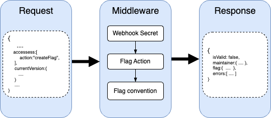

# Feature Flag Validation Service

A sample webhook service that validates feature flag configurations against organization standards when flags are created in LaunchDarkly. 

### Purpose:
* Enforces flag naming conventions (e.g., check for flag prefix)
* Validates required metadata (maintainer, description, tags)
* Provides extensible framework for custom actions on validation failures:
  * Email notifications
  * Automatic flag deletion scheduling
  * Slack notifications
  * Audit logging
  * etc.,

#### Validation Pipeline
  


### Endpoints
|method|endpoint|description|
|--|--|--|
|**POST**|*/validate-flag*|Validates feature flag configuration|


## Tech Stack
* [LaunchDarkly Webhook Integration](https://docs.launchdarkly.com/home/infrastructure/webhooks)
* Node.JS
* [Insomnia Test tool](https://insomnia.rest/) (optional)
  

## Setup
1. Create LaunchDarkly webhook, read [Webhook](https://docs.launchdarkly.com/home/infrastructure/webhooks).
2. Setup service.
	```
	npm install
	cp .env.example .env
	npm start
	```
3. Update the `.env` file with your webhook secret.
   ```
   WEBHOOK_SECRET=YOUR_WEBHOOK_SECRET
   ```
4. Load the `insominia-api-tests.json` in Insomnia to start testing.
   

## Request Format
*For sample payload see [Webhook:Designating the payload](https://apidocs.launchdarkly.com/tag/Webhooks#section/Designating-the-payload)*

The sample application validates the following fields from the payload:
- accesses.action  is equal to  **createFlag**
- currentVersion
  - name  prefixed with **ff_**
  - kind  prefixed with **ff_**
  - description is not empty
  - tags is not empty

*See **schema.js**, for validation rules.*

### Sample Request
>Note: *This is just a snippet of the LD flag payload generated by the LD Webhook integration, read [LaunchDarkly Webhook](https://apidocs.launchdarkly.com/tag/Webhooks) for details.*

```
{
  ...
  "accesses": [
    {
      "action": "createFlag",
      "resource": "proj/project-key:env/env-key:flag/flag-key"
    }
  ],
  "currentVersion": {
    "name": "ff_flag",
    "kind": "boolean",
    "description": "sample description",
    "key": "ff_flag_key",
    "tags": ["sampleTag001"],
	"_maintainer": {
		"_links": [
			null
		],
		"_id": "1234567890",
		"firstName": "Ray",
		"lastName": "Banister",
		"role": "owner",
		"email": "rbanister@examples.com"
	},
	...
  },
  ....
}
```


### Sample Response
For Invalid flag configuration
```
{
	"isValid": false,
	"maintainer": {
		"_id": "1234567890",
		"firstName": "Ray",
		"lastName": "Banister",
		"role": "owner",
		"email": "rbanister@examples.com"
	},
	"flag": {
		"name": "testflag",
		"kind": "boolean",
		"key": "projidTestflag",
		"title": "[Ray Banister](mailto:rbanister@examples.com) created the flag [testflag](https://invalid.invalid.com/sandbox/~/features/projidTestflag)",
		"titleVerb": "created the flag",
		"creationDate": 1734617269257
	},
	"errors": [
		{
			"field": "currentVersion.name",
			"message": "Flag name must start with ff_ prefix"
		},
		{
			"field": "currentVersion.key",
			"message": "Flag key must start with ff_ prefix"
		},
		{
			"field": "currentVersion.description",
			"message": "\"currentVersion.description\" is not allowed to be empty"
		},
		{
			"field": "currentVersion.tags",
			"message": "At least one tag is required"
		}
	]
}
```

ForValid flag configuration
```
{
  "isValid": true
}
```

# Resources
* [LaunchDarkly Webhook](https://apidocs.launchdarkly.com/tag/Webhooks)
* [Express.js](https://expressjs.com/en/5x/api.html)
* Joi - [sandbox](https://joi.dev/tester/), [API](https://joi.dev/api/?v=17.13.3)

